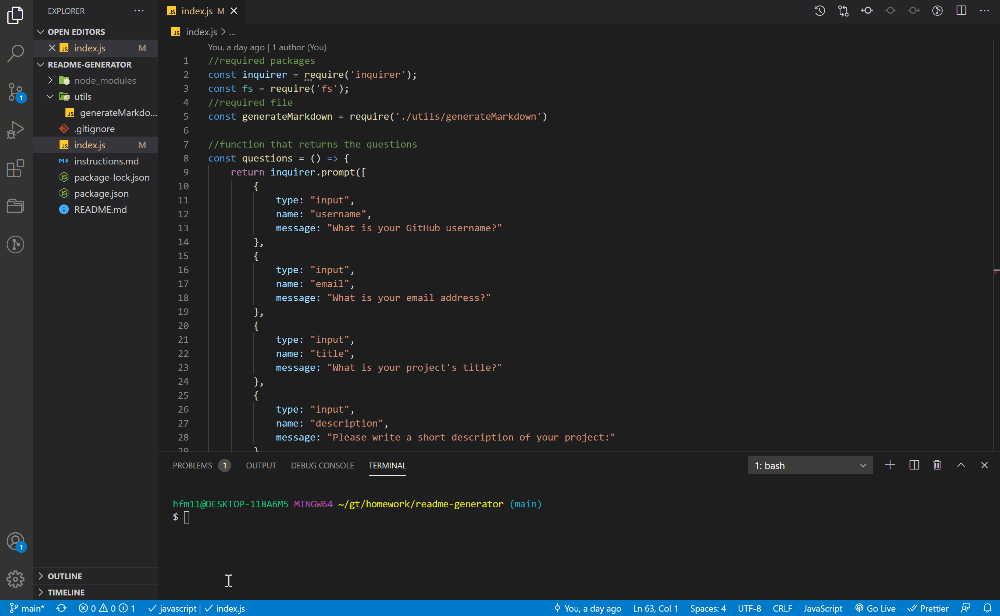

# ReadMe Generator

## Description
I wrote the script for this project to produce a well-formatted ReadMe

## Installation
N/A

## Usage 
It's awesome!

## License 
This project is covered under the GNU GPLV3 license.

## Tests
You can use these commands to run tests: N/A

## Collaborators

N/A

## How to Contribute

Please leave helpful comments! Thanks!

